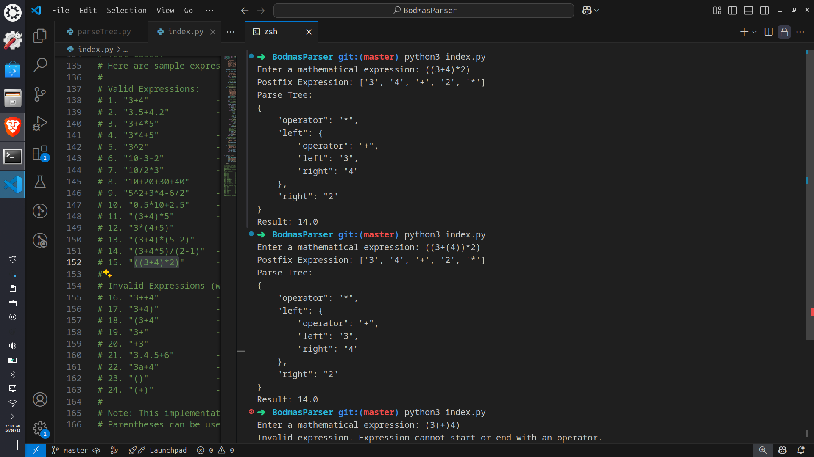

# BodmasParser

A Python project created as a learning exercise to understand how parse trees, AST (Abstract Syntax Trees) work and how mathematical expressions are evaluated in compilers. This repository is a small simulation of those concepts, designed for educational purposes and personal exploration of parsing and evaluation techniques.
No dependencies are used except for what can be found in the Python standard library. It exists solely for educational reasons.

---

## 📦 Codebase Overview

The codebase is organized into modular components:

- **operators.py**: Defines supported operators, their precedence, and provides utility functions for operator validation and application.
- **parseTree.py**: Implements the core data structures for representing and evaluating mathematical expressions as parse trees.
- **index.py**: The main entry point, providing a user-friendly interface for parsing, tree visualization, and evaluation.

---

## 🏗️ Class Structure & Relationships

### 1. `ParseNode`
- **Purpose**: Represents a single node in the parse tree (either an operator or operand).
- **Attributes**:
  - `value`: The string value (e.g., '+', '42').
  - `is_operator`: Boolean indicating if the node is an operator.
  - `left`, `right`: Child nodes (for operators).
- **Methods**:
  - `__repr__`, `__str__`: Debug and display utilities.
  - `is_leaf()`: Checks if the node is an operand.

### 2. `ParseTree`
- **Purpose**: Represents the entire parse tree for a mathematical expression.
- **Attributes**:
  - `__root`: The root node of the tree.
  - `__postfix`: The postfix token list used to build the tree.
- **Methods**:
  - `build_tree()`: Constructs the tree from postfix.
  - `get_root()`, `get_postfix()`: Accessors.
  - `execute()`: Evaluates the tree using the `Execute` class.
  - `__str__`: JSON-like representation for visualization.

### 3. `Execute`
- **Purpose**: Traverses the parse tree and computes the result.
- **Methods**:
  - `evaluate()`: Returns the computed float value.

### 4. `Parser` (in `index.py`)
- **Purpose**: User-facing class for parsing infix expressions, converting to postfix, building the tree, and evaluating.
- **Methods**:
  - `__infix_to_postfix()`: Converts infix to postfix.
  - `get_parse_tree()`: Prints the tree.
  - `evaluate()`: Returns the result.

---

## ⚡ Current Functionalities

- **Expression Validation**: Ensures only valid mathematical expressions are parsed (checks for valid characters, balanced parentheses, correct operator usage).
- **Infix to Postfix Conversion**: Converts standard infix expressions to postfix notation for easier parsing.
- **Parentheses Support**: Handles expressions with parentheses to control order of operations, including nested parentheses.
- **Parse Tree Construction**: Builds a binary tree representing the expression structure.
- **Evaluation**: Computes the result by traversing the parse tree.
- **Tree Visualization**: Prints a JSON-like structure of the parse tree for debugging and educational purposes.

---

## 🛠️ Extending Functionality

### Adding New Operators
To add new operators (e.g., modulus `%`, integer division `//`):
1. **Update `operators.py`:**
   - Add the new operator to the `operators` list.
   - Define its precedence in `get_precedence()`.
   - Add its logic in `apply_operator()`.
2. **Update Validation Logic:**
   - Ensure regex patterns in `is_valid_expression()` allow the new operator.

### Supporting Functions (e.g., `sin`, `cos`)
- Extend `operators.py` to recognize function names.
- Update parsing logic in `index.py` and tree construction in `parseTree.py` to handle unary operators/functions.

### Improving Expression Validation
- Enhance regex and logic in `is_valid_expression()` to support more complex syntactic checks (e.g., nested functions, variable names).

---

## 🚀 Future Scope

- **Support for Mathematical Functions:**
  - Add trigonometric (`sin`, `cos`, `tan`), logarithmic, and other advanced functions.
- **Verbose Error Reporting:**
  - Provide detailed feedback for invalid expressions.
- **Variable Support:**
  - Allow expressions with variables and assignment.
- **Custom Operator Definitions:**
  - Enable users to define their own operators and precedence.
- **Expression Simplification:**
  - Add symbolic simplification and pretty-printing.
- **Performance Optimization:**
  - Optimize tree construction and evaluation for large expressions.

---

## 📝 Usage Example

```python
from index import Parser

# Example without parentheses
expr = "34 + 5 * 60 - 8 / 2"
parser = Parser(expr)
print("Expression:", expr)
print("Postfix Expression:", parser.postfix)
print("Parse Tree:")
parser.get_parse_tree()
result = parser.evaluate()
print("Result:", result)

# Example with parentheses changing the order of operations
expr = "(34 + 5) * (60 - 8) / 2"
parser = Parser(expr)
print("\nExpression:", expr)
print("Postfix Expression:", parser.postfix)
print("Parse Tree:")
parser.get_parse_tree()
result = parser.evaluate()
print("Result:", result)
```
OR
RUN the `index.py` file directly to see the example in action:

```bash
python3 index.py
```

---

## 💡 Contributing & Customization

- Fork the repository and submit pull requests for new features or bug fixes.
- For custom operators or functions, update `operators.py` and relevant parsing logic.
- For advanced validation, enhance `is_valid_expression()`.

### Running Tests

The project includes a comprehensive test suite to validate functionality. To run the tests:

```bash
# Run all tests
python3 -m tests.test_parser

# Run tests with more detailed output
python3 -m tests.test_parser -v

# Run specific test classes
python3 -m tests.test_parser TestParseTree TestParser

# Run specific test methods
python3 -m tests.test_parser TestParser.test_evaluate

# Run validation-specific tests
python3 -m tests.test_validation -v

# Test parentheses handling
python3 -m tests.test_parentheses
```

### Adding Tests for Expression Extensions

When extending the expression parser with new features, follow these guidelines for comprehensive testing:

1. **Testing New Operators**:
   - Add tests in `test_operators.py` for each new operator:
     ```python
     # Example: Testing the modulus operator
     def test_modulus_operator(self):
         self.assertTrue(is_operator('%'))
         self.assertEqual(get_precedence('%'), 2)  # Same precedence as * and /
         self.assertEqual(apply_operator(10, 3, '%'), 1)
     ```

2. **Testing Expression Validation**:
   - Add tests in `test_validation.py` to verify valid and invalid expressions with new features:
     ```python
     # Example: Testing expressions with the modulus operator
     def test_modulus_expressions(self):
         self.assertTrue(is_valid_expression('10%3'))
         self.assertTrue(is_valid_expression('10+5%3'))
         self.assertFalse(is_valid_expression('10%%3'))  # Invalid consecutive operators
     ```

3. **Testing Parse Tree Construction**:
   - Add tests in `test_parser.py` to verify correct tree structure:
     ```python
     # Example: Testing parse tree with modulus
     def test_modulus_tree(self):
         postfix = ['10', '3', '%']
         tree = ParseTree(postfix)
         root = tree.get_root()
         self.assertEqual(root.value, '%')
         self.assertEqual(root.left.value, '10')
         self.assertEqual(root.right.value, '3')
     ```

4. **Testing Evaluation**:
   - Add tests to verify expression evaluation works correctly:
     ```python
     # Example: Testing evaluation with modulus
     def test_evaluate_modulus(self):
         parser = Parser("10%3")
         self.assertEqual(parser.evaluate(), 1)
         
         parser = Parser("10+5%3")
         self.assertEqual(parser.evaluate(), 12)
     ```

5. **Testing Edge Cases**:
   - Always test edge cases specific to your extension:
     - Division by zero (if adding new division operators)
     - Very large or small numbers
     - Precedence interactions with existing operators
     - Special characters or formatting

Please ensure all tests pass before submitting pull requests, and add new tests for new functionality.

---

## 👨‍💻 Authors & Contact

Developed by Debatreya. For questions or suggestions, please open an issue or contact via [LinkedIn](https://www.linkedin.com/in/debatreya-das-895517204/) or [Twitter](https://x.com/DebatreyaDas).
